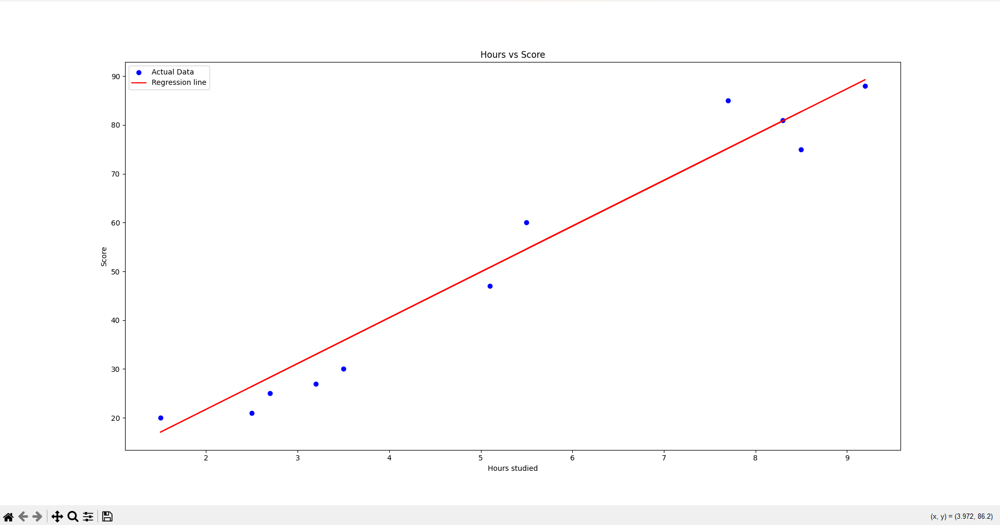

# Student Score Predictor 📈

This is a simple machine learning model that predicts student scores based on the number of hours studied, using Linear Regression.

### 📁 Files:
- `predictor.py` – Python script that loads data, trains the model, and plots results.
- `data.csv` – Dataset containing hours studied and scores.
- `requirements.txt` – Python dependencies.

### ⚙️ How it works:
1. Loads the dataset using pandas.
2. Splits the data into training and test sets.
3. Trains a Linear Regression model.
4. Predicts test values.
5. Plots actual vs predicted scores.

### 🛠 Libraries used:
- `pandas`
- `matplotlib`
- `scikit-learn`

### 📷 Output:


### 🔮 Example Prediction:
```bash
Actual  Predicted
4       35.81
9       28.21
27      33.00
